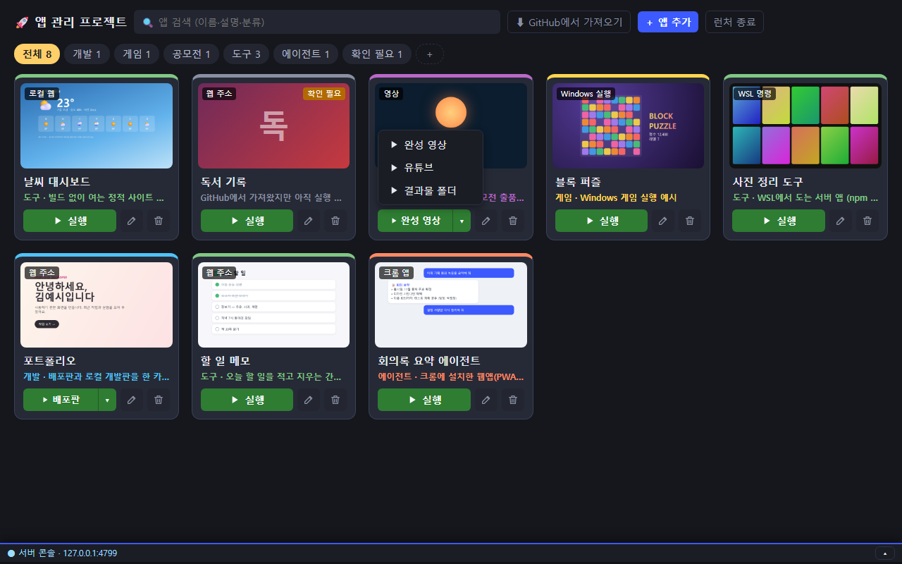
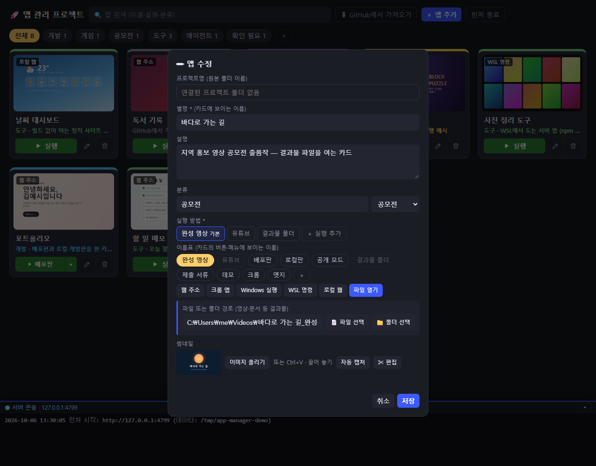

# 앱 관리 프로젝트 (app-manager)

**한국어** · [English](README.en.md)

직접 만든 앱과 결과물을 **카드 한 화면**에 모아 두고, 클릭 한 번으로 실행하는 개인용 런처입니다.
웹 주소, 크롬 앱, Windows 프로그램, WSL 명령, 정적 사이트, 영상·문서 같은 결과물까지 모두 카드 하나로 엽니다.


> 처음이세요? 단계별 설치 가이드를 보세요 → **[설치 가이드](docs/SETUP.ko.md)**

## 이게 왜 필요한가요?

바이브 코딩으로 앱을 하나둘 만들다 보면 결과물이 여기저기 흩어집니다. 배포 주소는 북마크에, 로컬 실행은 바탕화면 바로가기에, 공모전 영상은 다운로드 폴더에, 서버 앱은 터미널 명령으로만 남습니다.

앱 관리 프로젝트는 이것들을 **썸네일이 있는 카드**로 한곳에 모읍니다.

- 카드를 누르면 실행됩니다. 무엇으로 열지는 카드마다 정해 둡니다.
- 한 프로젝트에서 나온 여러 실행(배포판·로컬판, 완성 영상·유튜브·결과물 폴더)은 **한 카드**에 담습니다.
- Claude Code를 쓴다면 프로젝트에서 **"앱 관리 프로젝트에 등록해줘"** 한마디로 카드가 만들어집니다.

## 먼저 체험해 보기

설치하기 전에 예시 카드로 화면을 볼 수 있습니다. **WSL(우분투) 터미널**에서:

```bash
cd ~
git clone https://github.com/GojoSuperman/app-manager.git
cd app-manager
npm install
npm run demo
```

예시 카드 8장이 담긴 화면이 브라우저에 열립니다(`http://127.0.0.1:4799`). 예시는 임시 폴더에 만들어져서 실제 데이터와 섞이지 않습니다. 브라우저 창을 닫으면 잠시 뒤 저절로 꺼집니다.

## 설치하기

> ⚠️ 명령은 모두 **WSL(우분투) 터미널**에서 실행하세요. Windows PowerShell이 아닙니다.

```bash
cd ~
git clone https://github.com/GojoSuperman/app-manager.git
cd app-manager
bash scripts/setup.sh
```

`setup.sh`가 하는 일은 다음과 같습니다. 다시 실행해도 안전합니다.

1. Node.js 20 이상인지 확인
2. 의존성 설치 (`npm install`)
3. 데이터 폴더 만들기 (`~/.config/my-app-launcher`)
4. Claude Code용 **등록 스킬** 설치 (`~/.claude/skills/register-to-launcher`)
5. 바탕화면에 **"앱 관리 프로젝트"** 아이콘 만들기

설치가 끝나면 바탕화면 아이콘을 더블클릭하세요. 자세한 단계와 막혔을 때의 해결 방법은 [설치 가이드](docs/SETUP.ko.md)에 있습니다.

## 쓰는 법

### 카드 실행

- **▶ 실행**을 누르거나 카드를 누르면 실행됩니다.
- 실행이 여러 개인 카드는 **[▶ 기본 실행 │▾]** 버튼입니다. ▾로 다른 실행을 고릅니다.



### 카드를 만드는 세 가지 방법

| 방법 | 언제 |
|---|---|
| **＋ 앱 추가** | 직접 입력해 만들 때. 프로젝트 폴더를 고르면 원본 폴더도 연결됩니다 |
| **⬇ GitHub에서 가져오기** | 내 GitHub 저장소 목록에서 골라 한 번에 만들 때 (`gh` 로그인 필요) |
| **등록 스킬** (Claude Code) | 프로젝트 폴더에서 Claude Code에게 "앱 관리 프로젝트에 등록해줘" — 프로젝트를 살펴보고 실행 방법까지 채워 줍니다 |

GitHub에서 가져올 때 저장소에 **웹사이트 주소**가 있으면 바로 실행되는 카드가 됩니다. 내 PC에 내려받은 폴더가 있으면 그 안을 살펴 실행 방법을 **추측**합니다(🔎 README의 배포 주소, `npm start`·`npm run dev`, 정적 `index.html`). 웹 주소와 로컬 실행이 둘 다 있으면 **배포판·로컬판** 두 실행을 한 카드에 담습니다. 아무것도 못 찾으면 **"확인 필요"** 카드가 되고, 나중에 ✎ 수정이나 등록 스킬로 채웁니다.

### 실행 방법 6가지

| 실행 방법 | 여는 것 | 예 |
|---|---|---|
| 웹 주소 | 기본 브라우저로 주소 열기 | 배포한 웹앱 |
| 크롬 앱 | 크롬에 설치한 웹앱(PWA)을 앱 창으로 | 설치형 웹앱 |
| Windows 실행 | Windows 프로그램·`.bat`·`.vbs`·`.ps1` | 게임, 데스크톱 앱 |
| WSL 명령 | WSL에서 명령 실행 (새 터미널 창 또는 숨김) | `npm start` |
| 로컬 웹 | 빌드 없이 여는 `index.html` 폴더를 런처가 웹으로 띄움 | 정적 사이트 |
| 파일 열기 | 영상·문서·폴더를 Windows 기본 프로그램으로 | 공모전 완성 영상, 제출 서류 |

파일 열기 경로는 직접 적거나 **📄 파일 선택 / 📁 폴더 선택**으로 고릅니다(이 프로젝트 · ~/projects · 다운로드 · 바탕화면 · 문서 바로가기).



### 정리하기

- **분류 탭**: 카드를 끌어 탭 위에 놓으면 그 분류로 옮겨집니다. 탭 끝의 ＋로 새 분류를 만들고, 탭끼리 끌어 순서를 바꿉니다.
- **카드 순서**: 카드끼리 끌어서 바꿉니다.
- **썸네일**: 이미지 올리기·붙여넣기(Ctrl+V)·끌어 놓기 후 편집기로 위치·크기·회전·반전을 맞춥니다. 웹 주소 카드는 **자동 캡처**도 됩니다(Windows에 크롬 필요).
- 📁 버튼은 원본 프로젝트 폴더를 탐색기로 엽니다.

## Claude Code 등록 스킬

`setup.sh`가 `${CLAUDE_CONFIG_DIR:-~/.claude}/skills/register-to-launcher`에 설치합니다. 프로젝트 폴더에서 Claude Code에게 이렇게 말하면 됩니다.

> 앱 관리 프로젝트에 등록해줘

스킬은 README·`package.json`·실행 스크립트·배포 설정을 **읽기만** 해서 실행 방법을 정하고, 카드 초안을 보여 준 뒤 **확인을 받고** 등록합니다. 같은 프로젝트를 다시 등록하면 새 카드를 만들지 않고 기존 카드를 갱신합니다.

화면 위 **🧩 등록 스킬** 버튼으로도 설치·갱신할 수 있습니다. `~/.claude`와 `~/.claude-*` 폴더가 상태(최신·옛 판·미설치)와 함께 나오고, 고른 폴더에 설치합니다. 업데이트로 스킬이 바뀌면 버튼이 **🧩 스킬 업데이트**로 바뀝니다.

> 스킬은 Claude Code가 대화를 시작할 때 읽습니다. 설치·갱신한 뒤에는 **새 대화**를 열어 주세요.

## 요구사항

| 필요한 것 | 이유 |
|---|---|
| **Windows 10/11 + WSL2** | Windows 프로그램·브라우저를 WSL에서 띄움 → **macOS·일반 리눅스 미지원** |
| WSL 안의 **Node.js 20 이상** | 서버 실행 |
| (선택) Windows의 **Chrome** | 썸네일 자동 캡처, 크롬 앱 실행 |
| (선택) **GitHub CLI** (`gh`) 로그인 | GitHub에서 가져오기 |
| (선택) **Claude Code** | 등록 스킬 |

## 데이터는 어디에?

카드 정보는 저장소 밖 **`~/.config/my-app-launcher/`**에 저장됩니다. 저장소를 지우거나 업데이트해도 카드는 그대로입니다.

| 파일 | 내용 |
|---|---|
| `apps.json` | 카드 목록 (`apps.json.bak` 직전 판) |
| `thumbs/` | 썸네일 이미지 |
| `order.json` · `tab-order.json` | 카드 순서 · 분류 탭 순서 |
| `categories.json` · `labels.json` | 직접 추가한 분류 탭 · 실행 이름표 |
| `trash/` | 삭제한 카드 (되돌리기용) |

다른 폴더를 쓰려면 `MY_APP_LAUNCHER_HOME`을 지정하세요.

## 작동 방식과 보안

- 브라우저만으로는 PC 프로그램을 띄울 수 없어서, **WSL 안의 작은 로컬 서버**(Express)가 대신 실행합니다. 화면은 `http://127.0.0.1:4790`입니다.
- 서버는 **127.0.0.1에만** 열립니다. 요청마다 화면에 심어 둔 토큰과 출처(Origin)를 검사해, 다른 웹사이트가 실행 명령을 보낼 수 없습니다.
- 로컬 웹 앱은 다른 포트(`4791`)에서 제공해, 그 페이지가 런처의 실행 기능에 접근하지 못합니다.
- 런처는 **원본 프로젝트 파일을 고치지 않습니다**. 파일 찾아보기는 이름 목록만 읽습니다.
- 대시보드 창을 닫으면 10초 뒤 서버가 스스로 꺼집니다(`MY_APP_LAUNCHER_AUTO_SHUTDOWN=0`이면 끄지 않음).

## 업데이트

GitHub에 새 판이 올라오면 화면 위 버튼이 **⟳ 업데이트 (N)**으로 바뀝니다. 눌러서 **업데이트 받기** → **지금 다시 켜기**를 누르면 끝입니다.

- 받기는 `git pull --ff-only` + `npm install`입니다. 이 PC에서 고친 파일과 겹치거나 기록이 갈라졌으면 **아무것도 바꾸지 않고** 이유를 보여 줍니다.
- 다시 켜기는 서버를 새 코드로 다시 띄우고 화면을 새로고침합니다.

터미널로 하려면 `cd ~/app-manager && git pull && npm install` 후 **런처 종료** → 바탕화면 아이콘으로 다시 켜세요. 등록 스킬이 바뀌었으면 위쪽 버튼이 **🧩 스킬 업데이트**로 바뀌니 눌러서 갱신하세요.

## 테스트

```bash
npm test
```

## 라이선스

[MIT](LICENSE)
